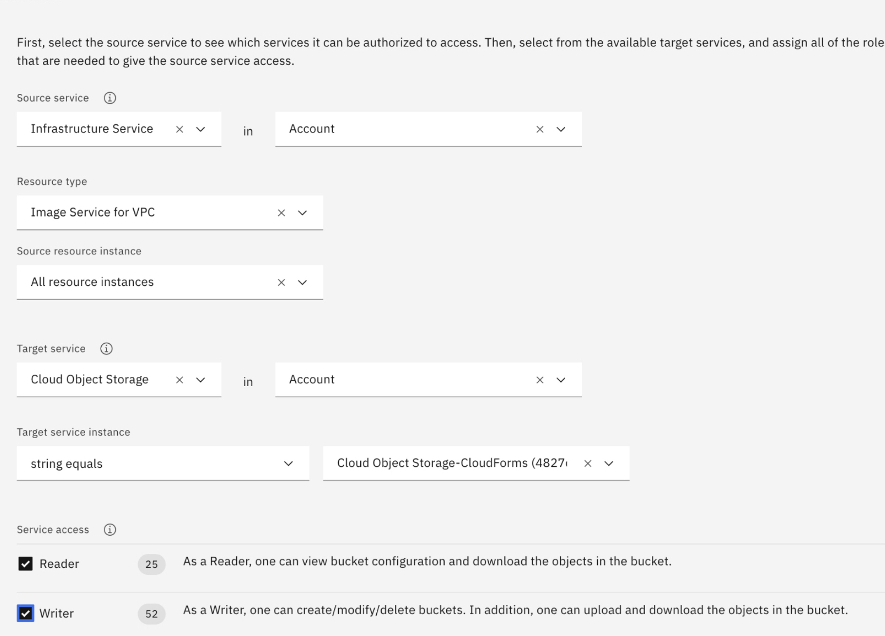
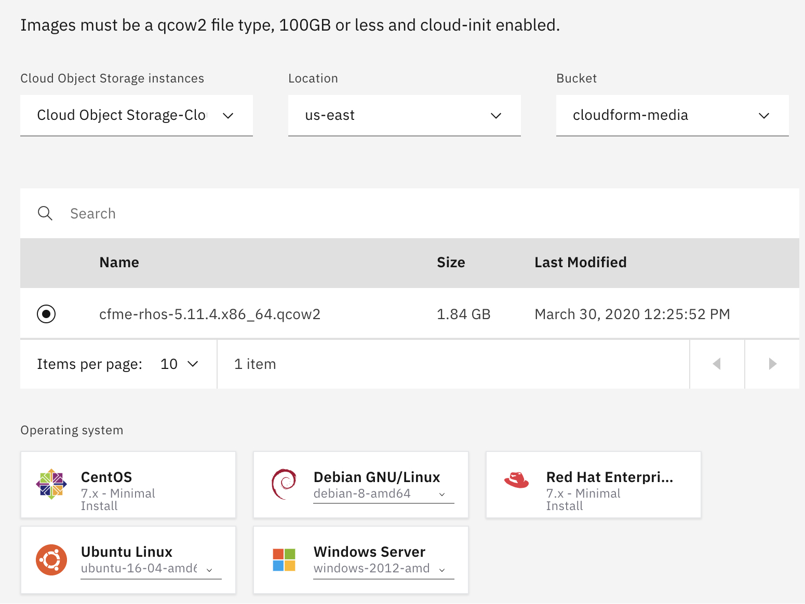
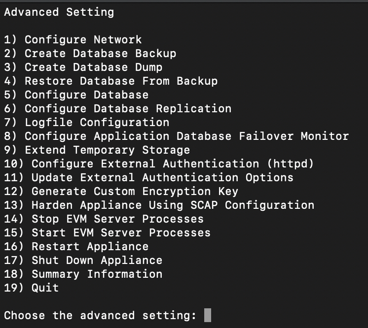
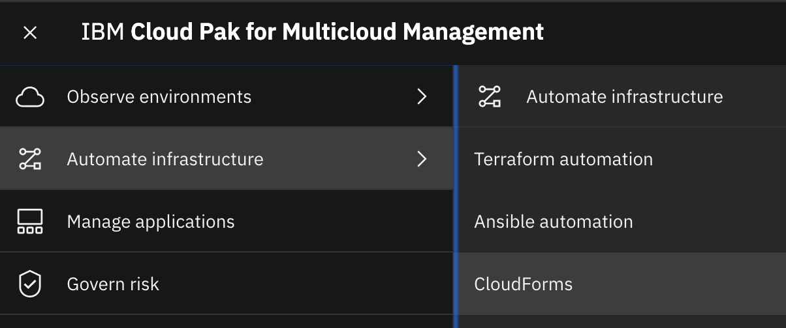

---

copyright:
  years: 2020
lastupdated: "2020-04-09"

keywords: getting started tutorial, getting started, cloudforms,

subcollection: writing

---

{:shortdesc: .shortdesc}
{:screen: .screen}
{:codeblock: .codeblock}
{:pre: .pre}
{:tip: .tip}
{:note: .note}
{:external: target="_blank" .external}

# Getting started with CloudForms in IBM Cloud
{: #getting-started}

CloudForms delivers the insight, control, and automation enterprises need to address the challenges of managing virtual environments. CloudForms enables enterprises with existing virtual infrastructures to improve visibility and control, and those just starting virtualization deployments to build and operate a well-managed virtual infrastructure. For more information, see the [CloudForms product documentation](https://access.redhat.com/documentation/en-us/red_hat_cloudforms/5.0/).
You can install CloudForms as a virtual appliance in IBM Cloud. 
{:shortdesc}

## Before you begin

- Before you can install CloudForms, you must download the images from [IBM Passport Advantage](https://www.ibm.com/software/passportadvantage/index.html). Download these installation images:

| Description                                                                      | File name                               | Passport Advantage part number |
|----------------------------------------------------------------------------------|-----------------------------------------|--------------------------------|
| Red Hat CloudForms 5 for Red Hat OpenStack Platform | cfme-rhos-5.11.4.x86_64.qcow2 |   CC5W9EN  |
| Automation navigation for {{site.data.keyword.cloud_pak_mcm}} 1.3 | automation-navigation-updates.sh | CC66KEN  |
|

- For the list of all part numbers, see [Passport Advantage part numbers](https://www.ibm.com/support/knowledgecenter/en/SSFC4F_1.3.0/about/part_numbers.html).  
- You must have an IBM Cloud user account with the following roles: 


- You must have {{site.data.keyword.cp4mcm_full_notm}} installed. For more information, see [Getting started with {{site.data.keyword.cp4mcm_full_notm}}](getting-started.md)  


## Step A. Setting up the Custom image for CloudForms in IBM Cloud
{: #config-image}
Create a custom Linux-based image to deploy CloudForms as a virtual server instance in the IBM Cloud.

1. If you don't already have an instance of IBM Cloud Object Storage, see [Getting started with IBM Cloud Object Storage](https://cloud.ibm.com/docs/services/cloud-object-storage?topic=cloud-object-storage-getting-started)

    Example Cloud Object Storage created:
    

    You must also create a bucket in IBM Cloud Object Storage to store your images.
    Example Standard type bucket created:
    

2. Upload the CloudForms installation images to your IBM Cloud Object Storage. Select your bucket and click Add Objects to upload the images. For more information, see [Uploading data by using the console](https://cloud.ibm.com/docs/services/cloud-object-storage?topic=cloud-object-storage-upload#upload-console). **Note:** You can use the Aspera high-speed transfer plug-in to upload images larger than 200 MB.  
Example by using Aspera uploaded file to bucket:


3. From IBM Cloud Identity and Access Management (IAM), create an authorization between the Virtual Private Cloud (VPC) Infrastructure (source service) > Image Service for VPC (resource type) and Cloud Object Storage (target service). For more information, see [Create an authorization](https://cloud.ibm.com/docs/iam?topic=iam-serviceauth#serviceauth).
    
    **Important**: The configuration must be set up as this example or permissions can fail. 
    

4. Create a second-generation Virtual Private Cloud (Must be 2nd generation). For more information, see [Create a VPC](https://cloud.ibm.com/docs/vpc?topic=vpc-getting-started#create-and-configure-vpc)
  
    a. Create a VPC - The VPC must be in the same resource group and region as your bucket.

    b. Create subnets in one or more zones. You can create subnets in suggested prefix ranges or in your own IP ranges that you bring to IBM Cloud.

    c. Attach a public gateway if you want to allow all resources in a subnet to communicate with the public internet.

    Example VPC: 

5. Configure an access control list (ACL) to limit the subnet's inbound and outbound traffic.

    Example: 


6. Import the CloudForms installation images from the bucket into the VPC.
  
    a. From the custom image tab under the result list, select import custom image.

    b. Enter a name.

    c. Select a resource group.

    d. Select region.

    Example:
    

    e. Select your Cloud Object Storage and bucket based on your authorization that is created in step 3.

    f. Select your qcow2 image.

    g. Select the Red Hat operating system.

    Example:

    
    h. Select import custom image.

    Example: 


7. Create a virtual server from the custom image by selecting "create virtual server".
  
   a. Enter your name.

   b. Select your region.

   c. Select the Red Hat operating system.

   d. Use Memory Profile (2 vcpus, 16 gb ram, 4 gps).

   e. Add an ssh key - Use a public key.

   Example:


    f. Add storage to your virtual service. For example, 100 gigabytes. This volume is needed to configure the CloudForms appliance. 

    Example:


    g. Select create virtual server instance. 
 
8. Update the security group that allows inbound and outbound traffic. (Need to harden this -ie 443, 5341...)

  Example:
  

9. Assign the floating IP address:

    Example 


Final result: 


## Step B. Setting up the CloudForms appliance:

1. ssh into your virtual server instance (appliance) by using the floating IP address.
  
   Example:
   ```
   ssh <host_ip_address>
   ```
 
2. Configure the appliance by following the steps in the [CloudForms documentation](https://access.redhat.com/documentation/en-us/red_hat_cloudforms/5.0/html/installing_cloudforms_on_red_hat_enterprise_virtualization/configuring-cloudforms).

    

    

- Networking is already configured. Skip this step
- Install the internal database, region, volume attachment is automatically found
- Stop and start the EVM
- Type url (https://floatingip) in browser. 


## Step C. Integrating CloudForms with {{site.data.keyword.cloud_pak}} {{site.data.keyword.gui}}

Enable navigation to CloudForms with {{site.data.keyword.cloud_pak}} {{site.data.keyword.gui}}.

Complete the following steps to enable navigation to CloudForms:

1. Obtain the menu customization script, `automation-navigation-updates.sh`, from [IBM Passport Advantage® ](https://www-01.ibm.com/software/passportadvantage/){: new_window} website. You must run the script on a {{site.data.keyword.linux_notm}} operating system.

2. Install and authenticate `kubectl`. For more information, see [Managing your clusters with {{site.data.keyword.mcm_notm}} ](../mcm/manage_cluster/intro.md).

3. Install JQ. For more information, see [Download jq ](https://stedolan.github.io/jq/download/){: new_window}.

4. Run the following commands to enable navigation to your CloudForms instance:

   ```
   chmod 755 ./automation-navigation-updates.sh

   ./automation-navigation-updates.sh -c <CloudForms URL>
   ```
   {: codeblock}

   * `-c` Is a required parameter that refers to the URL for the CloudForms {{site.data.keyword.gui}}.

5. Verify that the CloudForms instance is in the {{site.data.keyword.cloud_pak}} {{site.data.keyword.gui}} navigation menu. From the {{site.data.keyword.cloud_pak}} navigation menu, click **Automate infrastructure** > **CloudForms**.

CloudForms is integrated with the {{site.data.keyword.cloud_pak}} {{site.data.keyword.gui}}.



